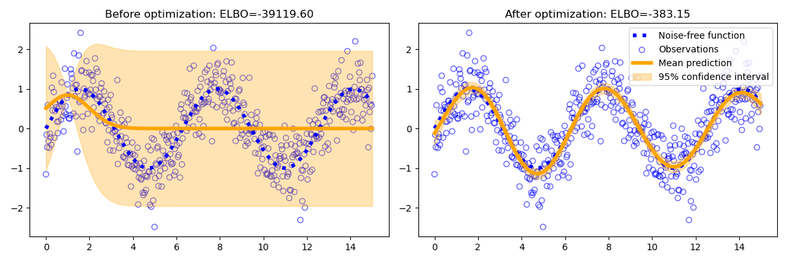

# StableGP

This library implements a robust version of Sparse Variational Gaussian Process regression in PyTorch.

The model tries to approximate the function $f(x)$ based on noisy observations $y = f(x) + \epsilon$ where $\epsilon$ is Gaussian noise. 



## Example

```
pip install stablegp
```

```python
import torch
from stablegp import SGPR, SEKernel

X = torch.linspace(0, 15, 100).reshape(-1, 1)
Y = torch.sin(X)

kernel = SEKernel(D=X.shape[1])
model = SGPR(X, Y, kernel, num_inducing=10)

model.fit()
pred_mean, pred_var = model.predict_f(X)
```

## Background

Gaussian process regression (GPR) is a powerful model since (1) it provides uncertainty estimates of each prediction (2) it's non-parametric and can fit many datasets well. However, for $N$ training observations a GP requires $O(N^2)$ memory and $O(N^3)$ computational complexity.
Sparse Gaussian process regression (SGPR) approximates the full model by using $M < N$ datapoints to approximate the whole dataset which reduces memory and computational complexities to $O(NM)$ and $O(NM^2)$ respectively. Despite these benefits, SGPR has been difficult to apply in practice to due common occurence of numerical errors. 

This library aims to make SGPR easy by providing a stable implementation that has not failed in our experiments in over 30 UCI datasets.  


## Things to be aware of 

1. **Hyperparameters**: The number of inducing points `num_inducing` is the only hyperparameter that requires tuning. Using more inducing points is guaranteed to lead to a better model at the cost of higher computation time and memory usage so the optimal value depends on your goals - fast training/inference vs predictive accuracy. 

2. **Data preprocessing**: You should standardise your data to mean 0 and unit variance e.g. via SciPy [StandardScaler](https://scikit-learn.org/stable/modules/generated/sklearn.preprocessing.StandardScaler.html). This reduces the chance of numerical errors. 

3. **Precision**: PyTorch uses float32 by default but GPs work best with float64 which can be enabled by adding `torch.set_default_dtype(torch.float64)` at the start of your script or by casting individual tensors, e.g. `X_train = X_train.to(torch.float64)`. Using float32 may lead to numerical instabilities and worse performance, however, float32 is still worth a try due to halved memory usage and because modern GPUs are much faster with float32 than float64. 

4. **Training**: we suggest using the training loop provided in `SGPR.fit()` since it has been tested and known to work well.

5. **Limitations**: currently we only support regression with a Gaussian likelihood and the squared exponential kernel. 

## Technical details

## Acknowledgements 

This library is heavily based on the work of GPFlow and RobustGP